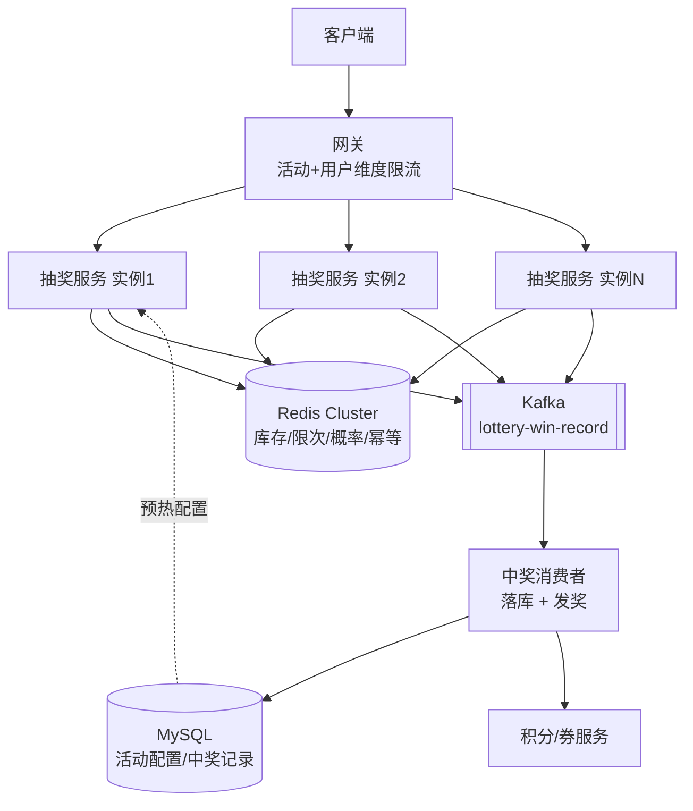
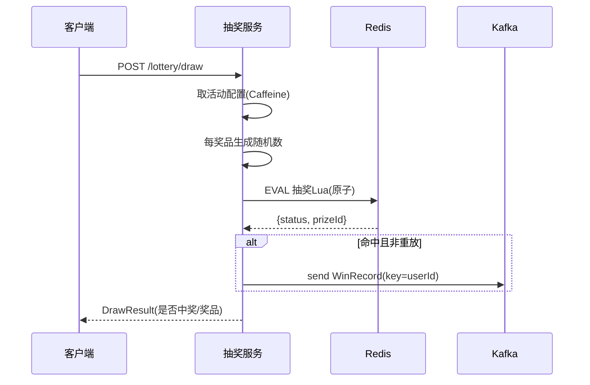
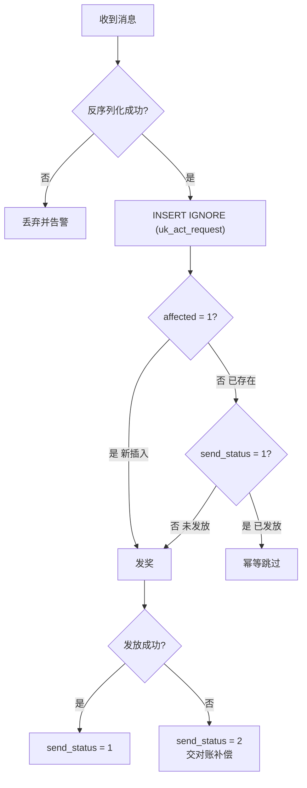

# 高并发抽奖系统设计文档

> 支持指定开始时间、多奖品(各自数量+独立概率)、时间片均匀发放,支撑 1w 并发与集群部署。
> 代码位于 `com.pikaqiu.lottery`,脚本与建表在 `src/main/resources/{lua,sql}`。

---

## 1. 需求与关键决策

| 需求 | 结论 |
|------|------|
| 活动指定开始时间 | 抽奖前校验时间窗;配置预热到本地缓存 |
| n 个奖品,各自数量、概率 | 每奖品独立配置 `prob_ppm` + `total_count` |
| 概率模型 | **各奖品概率独立**,按优先级顺序逐个掷,首个命中者决定结果 |
| 发放节奏 | **时间片奖池、均匀发放**(懒惰释放,未领配额顺延累积) |
| 命中但无库存 | **降级为未中奖**(不顺延到其他奖品) |
| 用户限制 | **每人限抽 N 次(总)**,未中奖也算一次 |
| 奖品类型 | **纯虚拟**(积分/券),命中即时展示 + 异步发放 |
| 并发/部署 | 1w 并发、集群部署;Redis 扛并发,服务无状态 |

**设计主线:内存(Redis Lua)扛并发 + 防超卖,MQ 削峰异步落库/发奖,服务无状态水平扩展。DB 不参与"抢"的过程。**

---

## 2. 整体架构



| 层 | 职责 | 技术 |
|----|------|------|
| 接入层 | 按 `actId` / 用户维度限流,防单活动打满 | 网关 |
| 服务层 | 无状态,组装参数执行 Lua、投递发奖 | Spring Boot,多实例 |
| 缓存层 | 库存/限次/概率/幂等的唯一真相源 | Redis (Cluster) |
| 异步层 | 削峰,解耦发奖履约 | Kafka |
| 存储层 | 活动/奖品配置、中奖记录 | MySQL |

---

## 3. 核心设计

### 3.1 时间片奖池 —— 懒惰释放,均匀发放

把活动 `[start, end]` 切成 `T = ceil((end-start)/sliceMs)` 个时间片,奖品总量 `Q` 均摊到每片。

**不依赖定时器**,而是在每次抽奖的 Lua 里"懒惰补齐"到当前时刻应释放的量:

```
应释放 = min(Q, floor(Q * 已过片数 / 总片数))
待补   = 应释放 - 已释放(released 记录)
if 待补 > 0: 可用库存 += 待补;已释放 = 应释放
```

- 未被领取的配额只加不减 → **自动顺延累积**,总量最终发完;
- 任意实例、任意请求都能自愈式推进进度 → **集群下无重复释放、无需分布式定时器**;
- 开场瞬间涌入,每片只放出一小部分 → 抢的压力被摊平到整个活动周期。

### 3.2 独立概率算法

各奖品概率独立(概率之和可 ≠ 100%)。按 `priority` 从高到低排序,逐个用独立随机数掷:

```
for prize in 优先级倒序:
    if rand(0~999999) < prize.probPpm:   # 命中该档
        懒惰释放该奖品库存
        if 扣库存 >= 0: 中该奖品; break   # 命中且有货 → 结束
        else:          未中奖;   break   # 命中但无货 → 降级(不看后面)
```

- 随机数由**应用层 `ThreadLocalRandom` 生成后传入**,规避 Redis Lua 内 `math.random` 的主从复制语义坑;
- `prob_ppm` 用百万分之表示,如 `5000 = 0.5%`,避免浮点;
- 概率之和 > 100% 时,先掷的高优先级奖品实际命中率更高——所以高价值奖品排前面。

### 3.3 防超卖

抽概率 → 释放 → 扣库存 全部放在**一个 Lua 脚本**里。Redis 单线程串行执行,整段脚本原子,天然无竞态、防超卖。命中但扣减结果 `<0` 时回滚 +1 并降级为未中奖。

### 3.4 三层幂等

| 层 | 机制 | 防止 |
|----|------|------|
| 抽奖 | `lottery:req:{actId}:{reqId}` 记录首次结果 | 重复请求重复扣次数/重复中奖 |
| 落库 | `uk_act_request` 唯一键 + `INSERT IGNORE` | MQ 重复消费重复插入 |
| 发奖 | 发放接口以 `requestId` 幂等 | 重复到账 |

---

## 4. 数据模型

见 [`src/main/resources/sql/lottery.sql`](../src/main/resources/sql/lottery.sql)。

| 表 | 说明 | 关键点 |
|----|------|--------|
| `t_lottery_activity` | 活动:开始/结束时间、时间片长度、每人限次 | — |
| `t_lottery_prize` | 奖品:概率 `prob_ppm`、数量、优先级 | `idx_act_id` |
| `t_lottery_record` | 中奖记录、发奖状态 | `uk_act_request` 落库幂等 |

`send_status`:`0` 待发放 / `1` 已发放 / `2` 发放失败。

---

## 5. Redis Key 设计

所有 key 用 `{actId}` 作 **hash tag**,一箭双雕:同活动 key 同 slot(多 key Lua 才能原子);不同活动天然分散到集群各节点,负载均衡。

| Key | 类型 | 说明 |
|-----|------|------|
| `lottery:req:{actId}:{reqId}` | string | 幂等,值=首次中奖的 prizeId(0=未中) |
| `lottery:user:{actId}` | hash | field=userId,值=已抽次数 |
| `lottery:stock:{actId}` | hash | field=prizeId,值=已释放未领取的库存 |
| `lottery:released:{actId}` | hash | field=prizeId,值=已释放总量(懒惰释放游标) |

> 库存无需预热初始化:`stock`/`released` 缺省视为 0,首次抽奖懒惰释放自动建立。全部 key 设 `ttl = 活动结束 + 1天 buffer`,活动完自动回收。

---

## 6. 抽奖 Lua 脚本契约

见 [`src/main/resources/lua/lottery_draw.lua`](../src/main/resources/lua/lottery_draw.lua)。

**KEYS**:`[1]` 幂等键 `[2]` 用户限次 `[3]` 可用库存 `[4]` 已释放

**ARGV**(顺序必须与 Java `buildArgs` 严格一致):

| 位置 | 含义 |
|------|------|
| 1~9 | now, userId, userLimit, startMs, endMs, sliceMs, totalSlices, ttlMs, prizeCount |
| 10.. | 每奖品 4 元组:`prizeId, probPpm, total, rand`(按优先级倒序) |

**返回 `{status, prizeId}`**:

| status | 含义 | prizeId |
|--------|------|---------|
| 1 | 正常处理 | >0 中奖 / 0 未中奖 |
| 2 | 幂等重放(返回首次结果) | 同上 |
| -1 | 活动未开始 | 0 |
| -2 | 活动已结束 | 0 |
| -3 | 抽奖次数用尽 | 0 |

**脚本内步骤**:幂等命中直接返回 → 时间窗校验 → 限次(超限回滚) → 独立概率逐个掷 + 懒惰释放 + 扣库存 → 记录幂等结果。

---

## 7. 抽奖主流程时序



对应实现:[`LotteryService.draw()`](../src/main/java/com/pikaqiu/lottery/service/LotteryService.java)。

---

## 8. 异步发奖链路(Kafka 版)

**生产者** [`KafkaLotteryRecordSender`](../src/main/java/com/pikaqiu/lottery/service/KafkaLotteryRecordSender.java):中奖事件序列化成 JSON 发到 `lottery-win-record`,**key=userId**(同用户保序 + 热点活动打散到多分区)。

**消费者** [`LotteryRecordConsumer`](../src/main/java/com/pikaqiu/lottery/consumer/LotteryRecordConsumer.java):



- 发奖履约(调发放接口 + 回写状态)抽到 [`LotteryFulfillmentService`](../src/main/java/com/pikaqiu/lottery/service/LotteryFulfillmentService.java),消费者与对账任务共用,行为一致;
- 发奖失败**不抛异常**(避免 poison 消息无限重投),置 `send_status=2`;
- **对账/补偿任务** [`LotteryReconcileTask`](../src/main/java/com/pikaqiu/lottery/task/LotteryReconcileTask.java):每分钟扫 `send_status ≠ 1` 且创建超过 5 分钟(避开在途)的记录重发,兜住"插库后未发奖就宕机""发奖接口临时故障"。集群下 `fulfill` 按 `requestId` 幂等,重复补偿安全;生产建议再加分布式锁或交 XXL-JOB 单实例调度。

---

## 9. 集群部署与容量估算(1w 并发)

- **服务无状态**:库存/限次/概率全在 Redis,LB 后挂 3~5 实例即可,单实例约 2~5k QPS。
- **Redis**:单 Lua 约 3~5w/s,单 master 足够扛 1w;为 HA 上主从/哨兵,或按 `actId` 分片到 Cluster。
- **Kafka**:1w msg/s 轻松;6 分区并行消费。
- **MySQL**:不参与抢,只接异步批量写,压力极小。

**要点:`{actId}` hash tag 使单活动所有库存 key 在同一 Redis 节点(约 3~5w/s 上限)。**

| 1w 并发口径 | 结论 |
|-------------|------|
| 全局总量(多活动分摊) | 单节点足够,集群仅为 HA + 多活动分散 |
| 单爆款活动峰值 | 1w 仍在单节点内 OK;若冲 5w+/s 需对该活动**库存分桶**(拆子桶分散多节点) |

---

## 10. 接口说明

### 抽奖 `POST /lottery/draw`

```bash
curl -X POST http://localhost:8080/lottery/draw \
  -H "Content-Type: application/json" \
  -d '{"actId":1,"userId":"u001","requestId":"req-001"}'
```

| 字段 | 说明 |
|------|------|
| actId | 活动ID |
| userId | 用户ID |
| requestId | 幂等ID,同一逻辑抽奖用同一值;为空则服务端生成(不去重) |

返回 `DrawResult`:`status`(WIN/NOT_WIN/NOT_STARTED/ENDED/LIMIT_EXCEEDED/ACTIVITY_NOT_FOUND)、`win`、`prizeId`、`prizeName`、`replay`、`message`。

### 预热 `POST /lottery/warmup?actId=1`

活动上线或改配置后调用,强制回源刷新本地缓存。

---

## 11. 配置说明

`application.yml` 开关 `lottery.record.sender` 控制发奖链路:

| 值 | 行为 | 依赖 |
|----|------|------|
| `kafka` | Kafka 异步落库 + 发奖 | MySQL + Kafka |
| `log` | 本地线程池打日志 | 无 |

已设 `hikari.initialization-fail-timeout: -1` 与 `spring.kafka.listener.missing-topics-fatal: false`,MySQL/Kafka 暂未就绪时应用仍能启动(异步链路降级打日志)。

---

## 12. 代码结构

```
com.pikaqiu.lottery
├── controller/LotteryController        抽奖 / 预热接口
├── service/
│   ├── LotteryService                  核心:组装参数、执行 Lua、解析结果
│   ├── LotteryConfigService            Caffeine 缓存活动配置
│   ├── LotteryRecordSender             发奖投递接口
│   ├── LogLotteryRecordSender          日志实现(sender=log)
│   ├── KafkaLotteryRecordSender        Kafka 实现(sender=kafka)
│   ├── LotteryFulfillmentService       发奖履约:发放 + 回写状态(消费者/对账共用)
│   └── PrizeGrantService               发券/加积分(mock)
├── consumer/LotteryRecordConsumer      幂等落库 + 触发发奖
├── task/LotteryReconcileTask           对账补偿:扫 send_status≠1 重发
├── dao/LotteryRecordDao                JdbcTemplate,INSERT IGNORE 幂等
├── loader/                             活动配置加载(Demo / 生产读DB)
├── config/                             Lua 脚本 Bean、Kafka topic
├── common/LotteryConstants             topic/消费组/状态常量
├── dto/  enums/                        请求/结果/配置/枚举
resources/
├── lua/lottery_draw.lua                抽奖核心脚本
└── sql/lottery.sql                     建表
```

---

## 13. 上生产待补(代码已留 TODO / 接口位)

1. `DemoActivityConfigLoader` → 读 DB 的实现;`PrizeGrantService` → 调真实积分/券服务(幂等)。
2. 对账任务已实现([`LotteryReconcileTask`](../src/main/java/com/pikaqiu/lottery/task/LotteryReconcileTask.java));生产再补**分布式锁/单实例调度**,以及 Redis 已发数 vs DB 记录数的**总量校准**。
3. 网关按 `actId` 限流;Redis 主从/哨兵;监控告警(中奖率、库存水位、消费积压)。
4. 单爆款活动 > 单 Redis 节点上限时,启用**库存分桶**。
5. 预热定时任务(活动开始前加载配置)需加**分布式锁**避免集群重复执行。

---

## 14. FAQ

**Q:开场瞬间会不会被抢光?** 不会。时间片懒惰释放,每片只放总量的 `1/T`,未领顺延。

**Q:某奖品抽空后?** 命中该档但无库存 → 降级为未中奖(按需求不顺延),中奖率自然下降。

**Q:重复点击/网络重试会重复中奖吗?** 不会。三层幂等,同 `requestId` 只认首次结果。

**Q:集群里定时器会重复发库存吗?** 无定时器。释放是抽奖时懒惰推进的,`released` 游标保证不重复。
